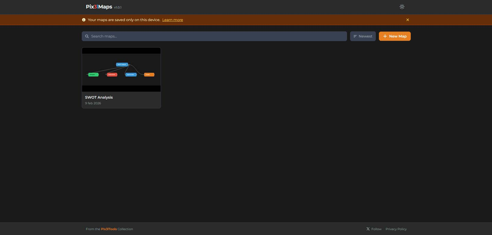

# Pix3lMaps

Pix3lMaps is a browser-based mind-mapping application built with Next.js and React Flow. Every map is stored locally in IndexedDB, so there is no server, no account, and no data ever leaves your device.



Create a new map from a blank canvas or pick one of the built-in templates (SWOT Analysis, Pros & Cons, Project Plan, Weekly Planner, Brainstorm, Meeting Notes) to get a head start. Nodes can be freely positioned or automatically arranged with radial and tree layouts. Each node supports custom colors, shapes, icons, images, comments, and links. Full undo/redo, keyboard shortcuts, PNG/JSON export, and JSON import round out the feature set.

## Features

- **Dashboard** — search, sort, duplicate, and delete maps at a glance
- **Templates** — seven ready-made structures for common use cases
- **Editor** — drag-and-drop canvas powered by React Flow with zoom, pan, and minimap
- **Node properties** — color, shape (rectangle / pill / diamond), font size, icon, image, comment, URL
- **Layouts** — radial, tree, and free positioning with animated transitions
- **Undo / Redo** — snapshot-based history with Ctrl+Z / Ctrl+Shift+Z
- **Move branch** — reparent a node and its subtree via context menu or Ctrl+X / Ctrl+V
- **Keyboard shortcuts** — Tab (add child), Enter (add sibling), Ctrl+X/V (move branch), Escape (deselect), Ctrl+S (save)
- **Export / Import** — PNG image export, JSON export and import
- **Themes** — light and dark mode via CSS custom properties
- **Offline-first** — all data stored in IndexedDB with Dexie.js; works without a network

## Tech Stack

- **Next.js 16** (App Router, TypeScript)
- **Tailwind CSS v4**
- **React Flow** (`@xyflow/react`)
- **Dexie.js** (IndexedDB)
- **Zustand** (state management)
- **html-to-image** (PNG export and thumbnails)

## Getting Started

```bash
npm install
npm run dev
```

Open [http://localhost:3000](http://localhost:3000) to start mapping.

## Deploy

The easiest way to deploy is on [Vercel](https://vercel.com). Push the repo and Vercel will build and serve it automatically.
